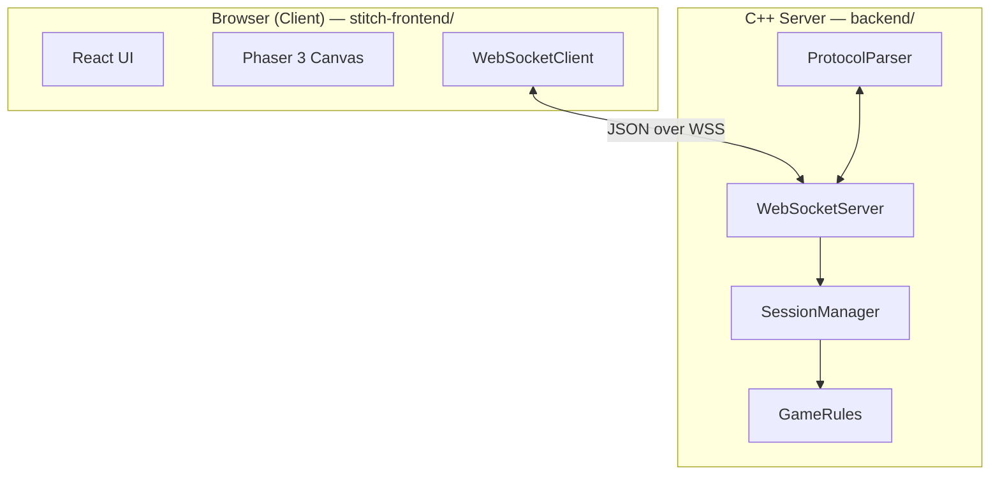

# Architecture Overview

## System Components

## Message Flow

1. **LOBBY_JOIN**: Client connects and identifies.
2. **MATCH_START**: Server pairs players and sends initial state.
3. **PLAYER_ACTION**: Client sends intent (Move, Strike, etc.).
4. **STATE_UPDATE**: Server validates, applies transitions, and broadcasts filtered state.
5. **GAME_OVER**: Server notifies clients of round conclusion.

## Directory Layout

| Path | Purpose |
|---|---|
| `stitch-frontend/src/` | React components, Phaser scenes, and networking. |
| `backend/src/` | Rules engine, state machine, and WebSocket implementation. |
| `protocol/` | Shared JSON message schemas. |
| `docs/` | Project documentation and mockups. |

## Key Design Decisions

- **Authoritative Server**: The server is the single source of truth; clients are pure views.
- **Filtered State**: Each client only receives information allowed by game rules (fog of war).
- **Hybrid Rendering**: React manages UI overlays/menus; Phaser handles the tactical map.
- **Isolated Sessions**: Each match is a self-contained room, enabling easier horizontal scaling.
