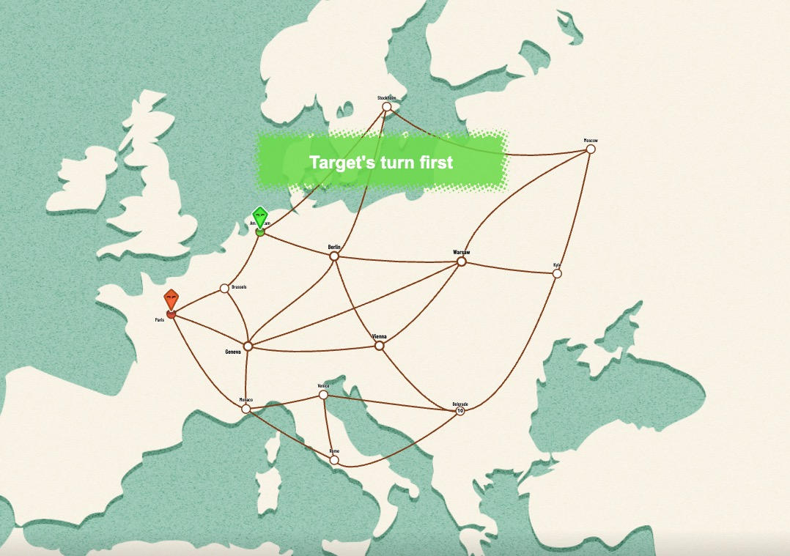
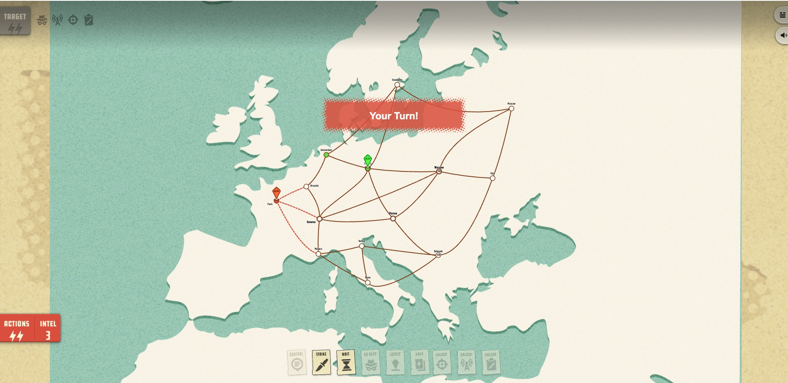
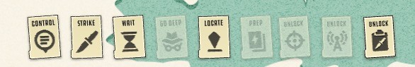
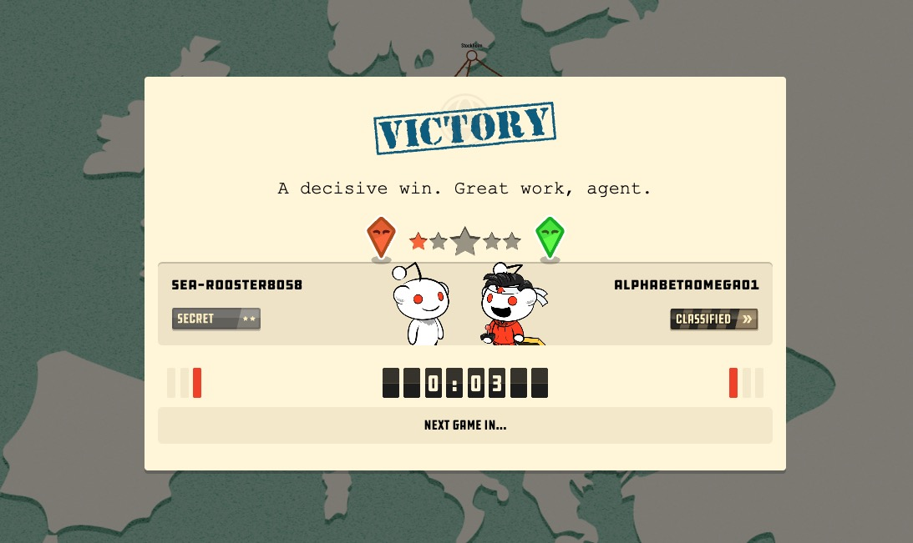

# Two Spies — Game Design Document (GDD)

**Overview**
*Two Spies* is a **turn-based 1v1 strategy game of espionage** set on a Cold War-era map of Europe. Two rival spies move secretly between connected cities, gather intelligence, leverage special abilities, and ultimately try to **locate and eliminate the opposing spy**.

---

## 1. Game Objective

> **Be the first player to correctly identify and strike the city where your opponent's spy is currently located.**

Players win a round by eliminating the opponent spy via an accurate strike. A full session is typically a best-of series (e.g., first to 3 wins).

---

## 2. Game World and Setup

### Map

* A graph of interconnected **cities** representing a stylized Cold War Europe.
* Each city is a **node**; connections (edges) define valid movement paths.
* All cities are uniform — there are no bonus or special cities.

### Starting Positions

* Each spy begins in a **random distinct city** that is **not adjacent** to the opponent's starting city.
* **Both players know each other's starting positions** — this information is shared at match start.
* Spy positions during the game remain hidden from the opponent until revealed by abilities or mistakes.

---

## 3. Turn Structure

### Actions per Turn

* Each turn consists of **two actions**.
* Actions can be spent on movement, abilities, strike, or wait.
* **Auto-end:** Turns automatically end after 2 actions are consumed.

### Movement

* A move travels to one **adjacent city** along a map edge.
* Moving typically places the player **under cover** (hidden from opponent deduction).

### Strike Action

* A player may use an action to attempt a **strike at their current location**.
* If the opponent is in the same city — the round ends, striker wins.
* If the opponent is not there — the attacking spy's **location is revealed** to the opponent.
* **The opponent is notified** that a strike attempt was made, even if it missed.
* **Implementation note:** Strike no longer requires city selection; it always targets current location.

### Wait Action

* A player may use an action to **wait** — consuming an action point without doing anything.
* Useful for ending turn early while preserving position or resources.

---

## 4. Shrinking Map Mechanic

To add strategic pressure and prevent indefinitely long matches, the game board progressively shrinks throughout the match.

### How It Works

* **Action Counter:** The server tracks a global cumulative action counter that increments every time either player takes an action (move, strike, ability use, or wait).
* **6-Action Cycle:** The action counter operates in cycles of 6.
  - At **action count 4:** A random city is selected and **marked for disappearance**. This city is highlighted with a **pulsing gold border** to visually alert both players.
  - At **action count 6:** The marked city **disappears**. The city is greyed out with a red X overlay, and all edges connected to it are removed from the graph.
  - The cycle repeats: at action 10 a new city is marked, at action 12 it disappears, and so on.

### Stranded Player Mechanic

If a player is currently in a city when it disappears, they become **stranded**:

* **Stranded Status:** The player can only take the **MOVE action** on their next turn. All other action buttons (Strike, abilities, Wait) are **disabled and greyed out**.
* **Recovery:** The stranded player must move to an adjacent city (that hasn't disappeared). Once they leave the disappearing city, their action options return to normal on subsequent turns.
* **Visual Indicator:** When a player is stranded, the UI displays an error message: *"You must move out of the disappearing city!"*

### Strategic Impact

* Disappearing cities create **urgency** — players must avoid getting trapped.
* The mechanic **encourages movement** and prevents camping in one location indefinitely.
* Players must **reason about timing** — being aware of the action count helps predict which cities will vanish.
* The **random city selection** prevents perfect prediction and keeps the game dynamic.

---

## 5. Resources

### Intel

Intel is the primary resource in *Two Spies*. It serves as both currency and a measure of player progress.

**Intel Income:**

Each turn grants Intel based on player actions:
* **Base:** +4 Intel per turn (always earned at end of turn)
* **Exploration Bonus:** +4 Intel if you move to a city you have not previously visited
  - This bonus is applied **at the end of your turn** when your current city is one you haven't been to before
  - **Clarification:** Starting cities do not grant the bonus (you start there, you don't "move" to it)
  - **Example:** Starting with 2 Intel → Move to Paris (new) → End turn = 2 + 4 (base) + 4 (exploration) = **10 Intel**
  - **Example:** 10 Intel → Stay in Paris (visited) → End turn = 10 + 4 (base) = **14 Intel**

**Total Intel per Turn:**
* No movement to new city: **+4 Intel**
* Movement to new city: **+8 Intel** (4 base + 4 exploration bonus)

**Intel Spending:**
* Spent to activate strategic abilities.
* Examples: Locate costs 10 Intel, other abilities have their own costs (defined in Section 6).

**Button Disabling:**
* If a player has fewer Intel points than an ability requires, that ability button is **disabled** and cannot be used.
* Example: If you have only 6 Intel, the Locate button (costs 10) is disabled until you earn more Intel.

---

## 6. Abilities

All abilities cost Intel and modify information visibility or mobility.

| Ability        | Cost | Effect                                                                 |
| -------------- | ---- | ---------------------------------------------------------------------- |
| Deep Cover     | 30   | Grants temporary invisibility until the end of your current turn. You may enter the opponent's controlled city without being discovered. The opponent's Locate ability cannot reveal your position while Deep Cover is active. |
| Encryption     | TBD  | Masks what Intel was spent on, limiting opponent deduction.            |
| Locate         | 10   | Reveals the opponent's current location with a prominent pulsing yellow marker. Forces opponent into visible state (removes opponent's cover) **UNLESS the opponent has Deep Cover active**. **The opponent is notified** that the Locate ability was used against them (unless blocked by Deep Cover). |
| Strike Report  | TBD  | Provides enhanced information after a strike attempt.                  |
| Rapid Recon    | TBD  | Grants additional movement options or reveals potential move paths.    |
| Prep Mission   | TBD  | Grants an extra action or sets up a future positional advantage.       |

### Deep Cover Mechanics

**Deep Cover** is a strategic ability that grants powerful defensive capabilities:

* **Cost**: 30 Intel
* **Duration**: Effective until the end of your current turn (expires at end_turn)
* **Protection**: While active, the opponent cannot use Locate to reveal your position
* **City Control Bypass**: You may enter opponent-controlled cities without your cover being blown
* **Strategic Use**: Use Deep Cover when you expect the opponent to use Locate, or to safely traverse opponent-controlled territory

When Deep Cover expires at the end of your turn, your cover status is determined by your last action (normal movement grants cover, striking removes it, etc.).

---

## 7. Cover and Visibility

Players are **visible** or **hidden** based on their cover state. The opponent can only strike a visible player; they must guess the position of a hidden player.

### Initial State
* Both players **start visible** to each other at the beginning of a match.
* Cover = false (opponent can see your position)
* Your icon appears **solid colored**.

### Cover Mechanics

**Actions that grant cover (player becomes hidden):**
| Action | Effect |
|--------|--------|
| MOVE | Moving to an adjacent city grants cover — your opponent loses sight of you. |
| WAIT | Waiting in place grants cover — your opponent loses sight of you. |
| Deep Cover (Ability) | Strategic ability to gain cover that persists until the end of your current turn. Grants immunity to Locate ability while active and allows entering opponent-controlled cities without being discovered. |

**Actions that remove cover (opponent becomes visible):**
| Event | Effect |
|-------|--------|
| CONTROL | Taking territorial control of a city reveals your location to the opponent. |
| LOCATE (Opponent uses) | If opponent uses Locate against you, your cover is blown — you become visible **UNLESS you have Deep Cover active**. If blocked by Deep Cover, you are not revealed or notified. |
| STRIKE | Attempting to strike reveals your location to the opponent. |

### Visual Indicators
* **Solid colored icon**: Opponent can see your current position. You are visible.
* **Translucent icon with solid border**: Opponent cannot see your current position. You are in cover.

---

## 8. Victory Conditions

A player wins a round when:

* They successfully **strike the city** where the opponent's spy is located.

A player loses a round when:

* They are struck in their current city.
* They end their turn in the **same city as the opponent** without cover (immediate reveal/loss).

---

## 9. Stealth and Fog of War

* Player positions are **private** — opponents only learn location through deduction and abilities.
* Cover state determines visibility: players with cover are hidden from opponent vision.
* Ending a turn in the same city as the opponent without cover results in an immediate loss.
* Actions and Intel spending can leak positional information — Encryption counters this.

---

## 10. Strategy and Player Goals

Players must balance competing priorities each turn:

| Strategic Element         | Purpose                               |
| ------------------------- | ------------------------------------- |
| Collect Intel             | Unlock strategic abilities            |
| Control bonus cities      | Increase per-turn Intel income        |
| End turns on pickup cities| Gain bonus actions or Intel           |
| Move under cover          | Maintain positional secrecy           |
| Use Encryption            | Prevent Intel spending from leaking   |
| Guess opponent's position | Prepare for a decisive strike         |

Successful play requires **deduction, movement planning, deception, and resource management**.

---

## 11. Game Modes

| Mode         | Description                              |
| ------------ | ---------------------------------------- |
| Quick Match  | Live 1v1 multiplayer (best of 5)         |
| Training Bot | Single-player practice against AI tutor  |
| Custom Maps  | User-created city graphs and layouts     |

---

## 12. Game Loop Summary

```
1. Initialization
   - Assign random distinct starting cities
   - Reset Intel to base value

2. Player Turn (repeat until win condition)
   - Player takes 2 actions: move, use ability, or strike
   - Server validates action and updates state
   - Server broadcasts filtered state to each player

3. Resource Collection (end of turn)
   - Intel += base rate + controlled city bonuses

4. Win Check
   - If strike hits opponent city → round over, striker wins
   - If both spies end turn in same city without cover → cover-blown loss
```

---

## 13. Implementation Notes

* Player positions must **never be sent to the wrong client**. The server must filter state per player before broadcasting.
* Map data (city nodes + edges) must be **external config**, not hardcoded in game logic.
* All action validation happens **server-side**. The client only sends intent.
* Intel costs and ability effects must be defined in a **centralized data structure** to allow balancing without logic changes.
* Cover state changes must be computed and enforced by the server each turn.

---

## 13. Visual Reference

The following screenshots from the original *Two Spies* game are stored in `docs/mockups/` and serve as the authoritative visual reference for UI layout, game board design, and UX decisions.

### Game Start

Shows the initial board state when a match begins — city graph layout, starting positions, and the initial UI chrome.

### Game Turn

Shows the in-progress turn view — the full board, player status, Intel counters, and action state during an active turn.

### Possible Actions

Shows the action selection strip — the UI element presented to the player when choosing between available actions (move, ability, strike).

### Game End

Shows the end-of-round screen — the result state displayed when a strike lands or cover is blown.
