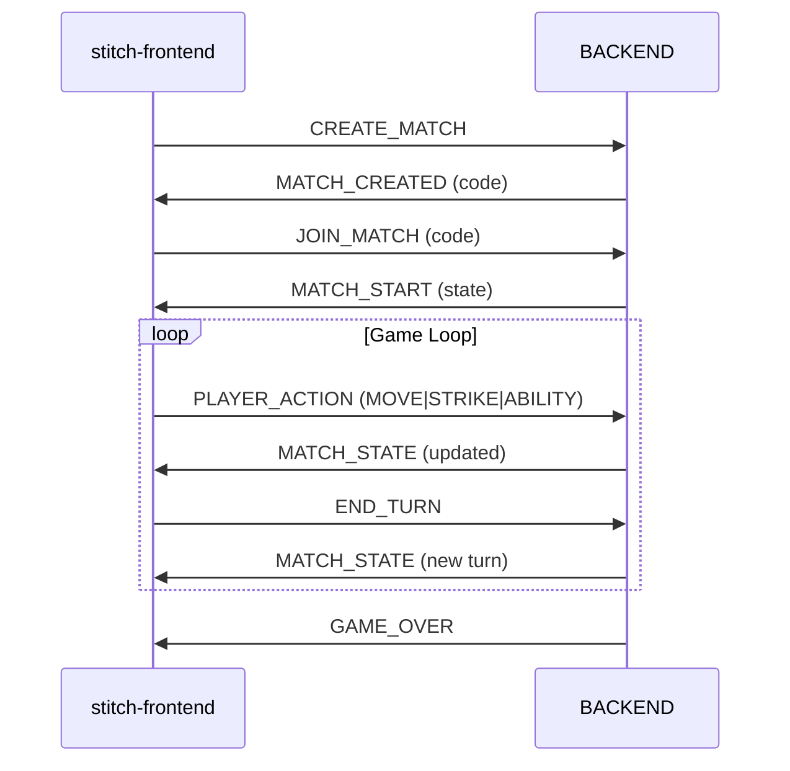

# Protocol Quick Reference

## Message Flow

---

## 📋 Client → Server Messages

| Message | Payload | Purpose |
|---|---|---|
| `CREATE_MATCH` | `{}` | Host creates a room. |
| `JOIN_MATCH` | `{code}` | Player joins a room. |
| `SET_PLAYER_NAME` | `{name}` | Set display name. |
| `PLAYER_ACTION` | `{action, ...}` | Move, Strike, or Ability. |
| `END_TURN` | `{}` | End current turn. |

---

## 📋 Server → Client Messages

| Message | Payload | Purpose |
|---|---|---|
| `MATCH_CREATED` | `{code}` | Room code generated. |
| `MATCH_START` | `{player}` | Match begins. |
| `MATCH_STATE` | `{turnNumber, player, ...}` | Authoritative state update. |
| `GAME_OVER` | `{winner, reason}` | Match conclusion. |
| `ERROR` | `{message}` | Validation or system error. |

---

## ⚡ Action Validation & Costs

| Action | Cost | Requirement |
|---|---|---|
| **MOVE** | 1 Action | Target must be adjacent. |
| **STRIKE** | 1 Action | Targets current location. |
| **LOCATE** | 10 Intel | Reveals opponent pulsing yellow. |
| **DEEP_COVER** | 30 Intel | Invisibility for the current turn. |
| **WAIT** | 1 Action | Consumes action point. |

---

## 🔍 Key Files

- **Frontend Types:** `stitch-frontend/src/types/Messages.ts`
- **Frontend WebSocket:** `stitch-frontend/src/network/WebSocketClient.ts`
- **Backend Rules:** `backend/src/game/GameState.cpp`
- **Backend Protocol:** `backend/src/protocol/Messages.cpp`
